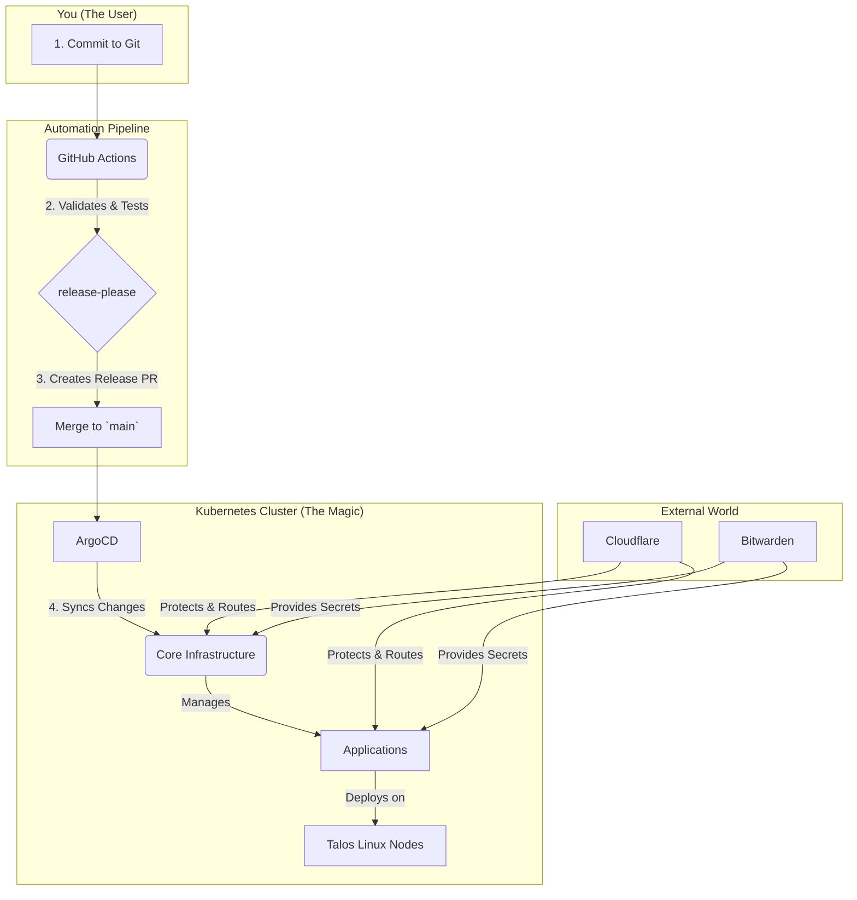

# 🏠 Over-Engineered GitOps Homelab

 

This is my personal homelab, managed entirely with GitOps. I built it to learn enterprise patterns and run self-hosted apps on a stable Kubernetes foundation. Everything here is the blueprint I use to automate and maintain my cluster. I'm sharing it to document what I've learned and to help anyone on a similar path.
[Quick Start →](https://homelab.orkestack.com/docs/quick-start)

## 🔧 Core Technologies

- **Orchestration:** Kubernetes on Talos Linux
- **Infrastructure as Code:** OpenTofu
- **GitOps:** Argo CD
- **Secrets:** Bitwarden
- **DNS & Security:** Cloudflare

---

## 🚀 Quick Start

1. Make sure you have Proxmox access with your SSH key and install `opentofu`, `talosctl`, `kubectl`, and `argocd`. A little Kubernetes and Git know-how helps.
2. Clone this repository and follow the steps in the [Quick Start guide](https://homelab.orkestack.com/docs/quick-start).

---

## ❓ Why This Homelab?

- **Everything as Code:** I describe the entire lab in this repo. That gives me a full audit trail and lets me rebuild from scratch.
- **Automated from Day One:** Provisioning, deployments, and secrets run on autopilot.
- **Secure by Default:** Non-root containers, network policies, and single sign-on are baked in from the start.
- **Real-World Learning:** I'm applying enterprise ideas at home so I can tinker and pick up new skills.

## 👥 Who Is This For?

- **The Learner:** Understand how a production-grade Kubernetes stack really works.
- **The Tinkerer:** Deploy self-hosted apps on a stable base without endless upkeep.
- **The Pro:** Experiment with enterprise patterns or run a lab that "just works." 

---

## 📐 Architecture Overview

More details are in [Architecture](https://homelab.orkestack.com/docs/architecture).

---

## 🛣️ Roadmap

- [ ] Hybrid cloud backups
- [ ] Node autoscaling
- [ ] Additional monitoring dashboards

---

## 🤝 Contributing

You can contribute! I'm currently the sole maintainer and would welcome collaboration on anything from typo fixes to new applications.

1. **Read the Docs:** Start with the [Contributing Guide](.github/CONTRIBUTING.md) to learn the workflow and standards.
2. **Find an Issue:** Look for items labeled [good first issue](https://github.com/theepicsaxguy/homelab/labels/good%20first%20issue) to get started quickly.
3. **Suggest an Idea:** Have a feature request? [**Open an issue**](https://github.com/theepicsaxguy/homelab/issues/new?template=feature_request.md) and let's talk about it.

For questions, open an issue or start a discussion. More details are at [homelab.orkestack.com](https://homelab.orkestack.com).

---

## 📄 License

MIT – see [LICENSE](LICENSE) for details.

---

## 🙏 Credits

Inspired by [Vehagn's Homelab](https://github.com/vehagn/homelab).
