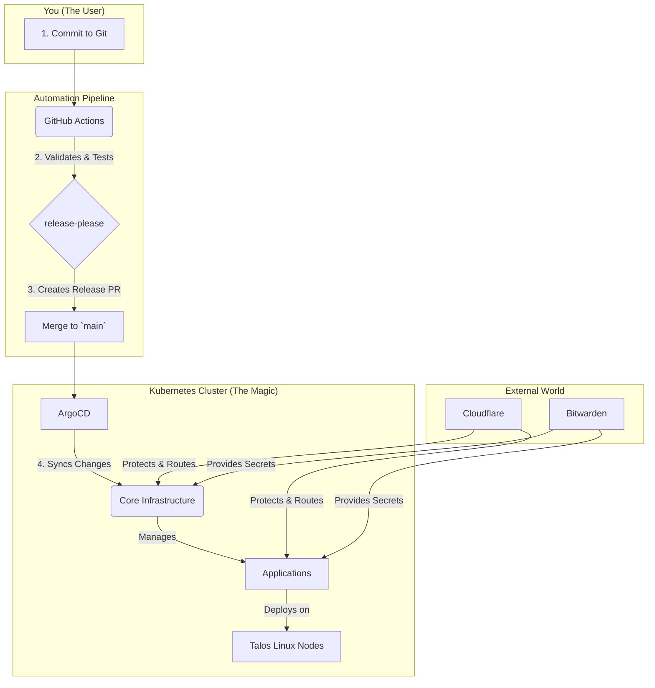

# 🏠 Over-Engineered GitOps Homelab

 

The Production-Grade, GitOps-Driven Homelab You Can Actually Maintain.
Stop firefighting your VMs. This repository provides a fully automated, self-healing Kubernetes blueprint so you can spend less time fixing and more time building.
[Quick Start →](https://homelab.orkestack.com/docs/quick-start)

---

## 🚀 Quick Start

Clone this repository and follow the steps in the [Quick Start guide](https://homelab.orkestack.com/docs/quick-start).

---

## ❓ Why This Homelab?

- **Declarative & Auditable:** Every piece of the lab—from the OS to the apps—is defined here. You get a full, versioned audit trail.
- **Automated From Day One:** Provisioning, deployments, secrets, and versioning run without manual babysitting.
- **Secure by Default:** Non-root containers, network policies, externalized secrets, and SSO baked in.
- **Built for Real-World Use:** Enterprise ideas adapted for the homelab so you learn skills that translate to work.

## 👥 Who Is This For?

- **The Learner:** Understand how a production-grade Kubernetes stack really works.
- **The Tinkerer:** Deploy self-hosted apps on a stable base without endless upkeep.
- **The Pro:** Experiment with enterprise patterns or run a lab that "just works." 

---

## 📐 Architecture Overview

More details are in [Architecture](https://homelab.orkestack.com/docs/architecture).

---

## 📋 Prerequisites

- Proxmox access with your SSH key
- Tools: `opentofu`, `talosctl`, `kubectl`, `argocd`
- Basic knowledge of Kubernetes and Git

---

## 🛣️ Roadmap

| Milestone | Target |
|-----------|-------|
| Hybrid cloud backups | Q3 2024 |
| Node autoscaling | Q4 2024 |
| Additional monitoring dashboards | Q1 2025 |

---

## 🤝 We Need Your Help

This project thrives on community input. Whether you're fixing a typo or adding a new app, your help is welcome.

1. **Read the Docs:** Start with the [Contributing Guide](.github/CONTRIBUTING.md) to learn the workflow and standards.
2. **Find an Issue:** Look for items labeled [good first issue](https://github.com/theepicsaxguy/homelab/labels/good%20first%20issue) to get started quickly.
3. **Suggest an Idea:** Open a feature request and let's talk about it.

For questions, open an issue or start a discussion. Dive deeper at [homelab.orkestack.com](https://homelab.orkestack.com) and start your self-healing Kubernetes journey.

---

## 📄 License

MIT – see [LICENSE](LICENSE) for details.

---

## 🙏 Credits

Inspired by [Vehagn's Homelab](https://github.com/vehagn/homelab).
