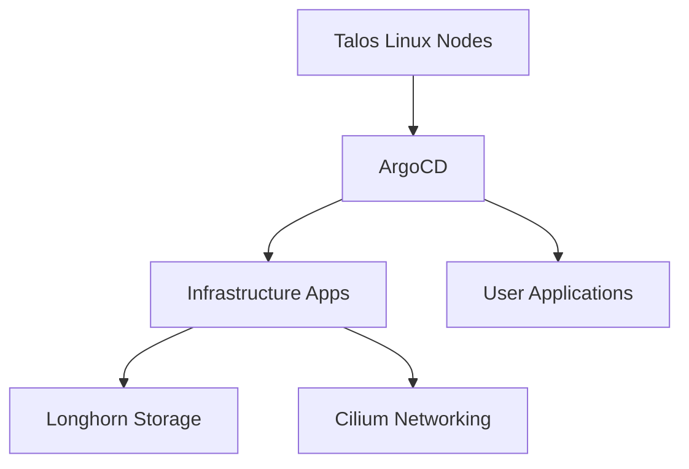

# 🏠 Over-Engineered GitOps Homelab

 

A self-healing Kubernetes cluster on Talos Linux and ArgoCD—no more 3 AM VM firefighting.
[Quick Start →](https://homelab.orkestack.com/docs/quick-start)

---

## 🚀 Quick Start

Clone this repository and follow the steps in the [Quick Start guide](https://homelab.orkestack.com/docs/quick-start).

---

## ❓ Why Choose This Homelab?

- **Self-healing Kubernetes cluster** powered by ArgoCD
- **Single repository GitOps workflow** – every change is version controlled
- **Disaster recovery in under five minutes** using a simple 4-command process

This setup is tuned for busy users who want a dependable, low-maintenance cluster.

---

## 📐 Architecture Overview

More details are in [Architecture](https://homelab.orkestack.com/docs/architecture).

---

## 📋 Prerequisites

- Proxmox access with your SSH key
- Tools: `opentofu`, `talosctl`, `kubectl`, `argocd`
- Basic knowledge of Kubernetes and Git

---

## 🛣️ Roadmap

| Milestone | Target |
|-----------|-------|
| Hybrid cloud backups | Q3 2024 |
| Node autoscaling | Q4 2024 |
| Additional monitoring dashboards | Q1 2025 |

---

## 🤝 Getting Involved

Contributions are welcome! Bug reports, feature ideas, and pull requests all help make this project better for everyone learning GitOps.

See [CONTRIBUTING](.github/CONTRIBUTING.md) for guidelines.

For questions, open an issue or start a discussion.

Dive deeper at [homelab.orkestack.com](https://homelab.orkestack.com) and start your self-healing Kubernetes journey.

---

## 📄 License

MIT – see [LICENSE](LICENSE) for details.

---

## 🙏 Credits

Inspired by [Vehagn's Homelab](https://github.com/vehagn/homelab).
