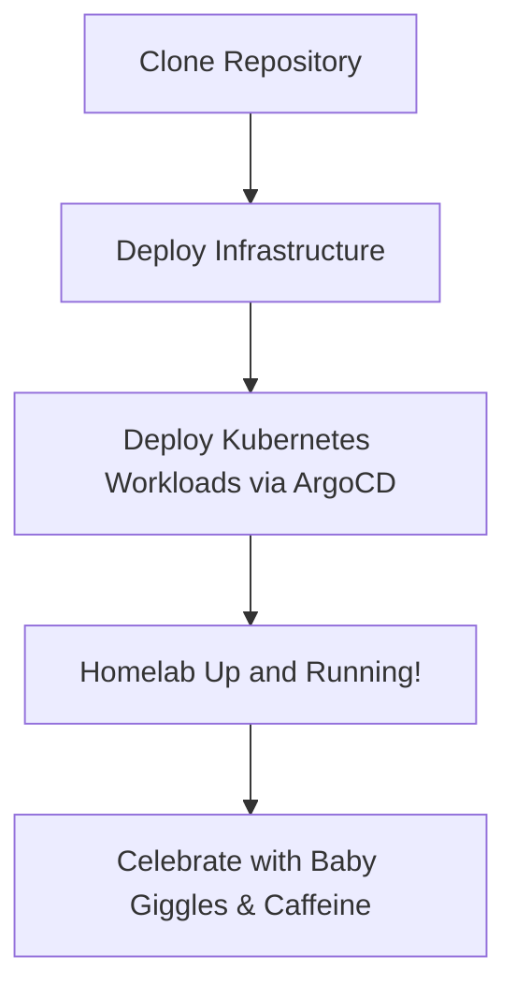

# 🏠 **The Homelab That Refuses to Die**

#### _Because when life gets busy (and a kid is on the way), infrastructure shouldn’t be another toddler to babysit._

---

## 📌 Project Summary & Key Features

**The Homelab That Refuses to Die** is a fully automated, GitOps-driven infrastructure solution designed for minimal
downtime and rapid recovery. It leverages a blend of modern tools to create a self-healing, resilient homelab that
minimizes manual intervention—letting you focus on what truly matters.

**Key Features:**

A fully automated, GitOps-driven infrastructure solution with:

- Three-environment progression (dev → staging → prod)
- Self-healing through ArgoCD
- Environment-specific resource management
- High availability in staging/production
- Pure GitOps workflow

<div align="center" style="display: flex; justify-content: center; gap: 20px; align-items: center;">
  <a href="https://kubernetes.io">
    
  </a>
  <a href="https://www.proxmox.com">
    
  </a>
  <a href="https://talos.dev">
    
  </a>
  <a href="https://opentofu.org">
    
  </a>
</div>

<p align="center">
  <em>Built with love, caffeine, and a whole lot of "not again!" moments.</em>
</p>

<p align="center">
  
  
  
  
  
  
</p>

<details>
  <summary>📊 GitHub Stats</summary>


</details>

---

<details>
  <summary>📑 Table of Contents</summary>

- [Project Summary & Key Features](#-project-summary--key-features)
- [Quick Start Guide](#-quick-start-guide)
- [Introduction & Motivation](#-introduction--motivation)
- [Infrastructure & Applications](#-infrastructure--applications)
  - [The Tech Stack](#the-tech-stack)
  - [What’s Inside?](#whats-inside)
- [Operational Excellence](#-operational-excellence)
  - [Disaster Recovery: The 4-Command Rule](#disaster-recovery-the-4-command-rule)
  - [Design Goals](#design-goals)
  - [Performance Metrics](#performance-metrics)
- [Project Journey & Future Vision](#-project-journey--future-vision)
  - [Evolution: Lessons, Pitfalls & Epiphanies](#evolution-lessons-pitfalls--epiphanies)
  - [Roadmap: What’s Next?](#roadmap-whats-next)
- [Getting Involved](#-getting-involved)
  - [Getting Started](#getting-started)
  - [Contributing](#contributing)
  - [Contributing Guidelines & Code of Conduct](#-contributing-guidelines--code-of-conduct)
- [Community & Support](#-community--support)
- [FAQ](#-faq)
- [Final Thoughts](#final-thoughts)
- [License](#license)

</details>

---

## 💖 Introduction & Motivation

> **💡 Pro Tip:** Embrace chaos with a smile, a hearty laugh, and an endless cup of coffee!

This project began as a **"let's learn Kubernetes"** experiment and quickly escalated into a full-blown **"automate my
entire home before the baby arrives"** mission.

For years, my lovingly handcrafted VMs were a ticking time bomb:

- 🚨 **Something crashes** → 🛠 **Frantic manual fix** → ⏳ **Another meltdown in weeks** → 🔁 _Rinse, repeat, and cry
  quietly at 3 AM._

With a little one on the way (and a full plate of diapers, sleep-deprived nights, and a to-do list longer than a CVS
receipt), I needed a homelab that:

- ✅ **Self-heals** (because midnight debugging is a luxury I can’t afford)
- ✅ **Rebuilds in 4 commands or less** (so I can spend more time on baby cuddles)
- ✅ **Runs without babysitting** (automation for the win)

Thus, this homelab was born—fully automated, GitOps-driven, and ready to survive chaos, spills, and the occasional
tantrum.

---

## 🖥 Infrastructure & Applications

### Core Infrastructure

Our infrastructure follows a strict GitOps-based organization:

```
k8s/
├── infrastructure/          # Core Infrastructure
│   ├── base/       # Base components
│   └── overlays/   # Environment configs
│       ├── dev/    # Development (Wave 0)
│       ├── staging/# Staging (Wave 1)
│       └── prod/   # Production (Wave 2)
└── apps/          # Applications
    ├── base/      # Base applications
    └── overlays/  # App environments
```

### Technology Stack

- **Talos Linux**: Kubernetes-native OS
- **ArgoCD**: GitOps deployment engine
- **Cilium**: eBPF-powered networking
- **Kustomize**: Configuration management
- **Bitwarden**: Secrets management

### What’s Inside?

#### **Core Infrastructure**

- **Authentication:** Authelia, LDAP (keeping the riff-raff out so the baby can nap in peace)
- **Monitoring:** Prometheus, Grafana, Loki (metrics to soothe even the most anxious parent)
- **Storage:** Proxmox CSI, Longhorn, TrueNAS (distributed storage that scales with your dreams)
- **Networking:** Cilium, CoreDNS, Gateway API (networking wizardry to keep things connected)

#### **Applications**

- **Jellyfin:** Because Plex is _so mainstream_ (and the baby’s already got good taste)
- **Dev Environments:** For when you need to build, break, and rebuild (often simultaneously)
- **Home Automation:** Making your home smarter while you catch a few winks
- **And More:** Because the best ideas often come at 2 AM amidst diaper changes

### Services Exposure

#### Services Exposed via Subdomains

- AdGuard: `adguard.kube.pc-tips.se`
- Authelia: `authelia.kube.pc-tips.se`
- Grafana: `grafana.kube.pc-tips.se`
- Hubble: `hubble.kube.pc-tips.se`
- Jellyfin: `jellyfin.kube.pc-tips.se`
- Lidarr: `lidarr.kube.pc-tips.se`
- Prowlarr: `prowlarr.kube.pc-tips.se`
- Prometheus: `prometheus.kube.pc-tips.se`
- Radarr: `radarr.kube.pc-tips.se`
- Sonarr: `sonarr.kube.pc-tips.se`
- Home Assistant: `haos.kube.pc-tips.se`
- Proxmox: `proxmox.kube.pc-tips.se`
- TrueNAS: `truenas.kube.pc-tips.se`
- ArgoCD: `argocd.kube.pc-tips.se`

#### Services Exposed via IPs

- Unbound DNS: `10.25.150.252`
- AdGuard DNS: `10.25.150.253`
- Torrent: `10.25.150.225`
- Whoami: `10.25.150.223`

<details>
  <summary>💡 Advanced Kubernetes Provider Configuration</summary>

We now leverage a **performance-first approach** with `local.kubeconfig_data` derived from Talos resources. Our
Kubernetes provider is set with:

- `load_config_file = false`
- `apply_retry_count = 3`

_All in the name of rock-solid, GitOps-only deployments._

</details>

---

## 📝 Documentation

Detailed docs in `/docs` - because even I forget how this all works sometimes:

- [🏗 Architecture Deep Dive](docs/architecture.md)
- [🌐 Network Magic Explained](docs/network-architecture.md)
- [💾 Storage Setup](docs/storage-architecture.md)
- [🔐 Security Model](docs/security-architecture.md)
- [📊 Monitoring Stack](docs/monitoring-architecture.md)

---

## 🚀 Quick Start Guide

If you’re eager to deploy your homelab without delay, follow these concise steps:

1. **Clone the Repository:**

   ```bash
   git clone https://github.com/theepicsaxguy/homelab.git
   cd homelab
   ```

2. **Install Prerequisites:** Ensure you have [Tofu](https://opentofu.org) installed along with any other necessary
   dependencies.

3. **Deploy Your Infrastructure:**

   - Navigate to the infrastructure directory and run:

     ```bash
     cd tofu/kubernetes
     tofu init && tofu apply
     ```

   - Deploy Kubernetes workloads via ArgoCD:

     ```bash
     cd ../../k8s
     tofu init && tofu apply
     ```

     _Refer to the [Disaster Recovery: The 4-Command Rule](#disaster-recovery-the-4-command-rule) section for more
     details._

4. **Verify & Enjoy:** Check your deployment status and celebrate as your homelab comes to life, ready to self-heal and
   scale on its own.

---

## 🚀 Operational Excellence

### Disaster Recovery: The 4-Command Rule

When disaster strikes (and it will, like that unexpected diaper blowout), the homelab is designed to resurrect in
minutes:

```bash
# 1. Clone the repository
git clone https://github.com/theepicsaxguy/homelab.git
cd tofu/kubernetes

# 2. Deploy the infrastructure
tofu init && tofu apply

# 3. Deploy Kubernetes workloads via ArgoCD
cd ../../k8s
tofu init && tofu apply
```

> **Quick Note:** Back online faster than you can say, "Where did my sanity go?" 😅

#### Disaster Recovery Flowchart

Below is a Mermaid diagram illustrating the disaster recovery process in all its quirky glory:



### Design Goals

- 🛠 **Minimal Overhead:** If I have to babysit my homelab, I’ve already lost.
- 🔄 **Self-Healing:** Break it, and it’ll fix itself—miracles of modern tech.
- 🚀 **Rapid Recovery:** Total disaster? Rebuild in minutes so you can focus on playtime.
- 🛡 **Zero Trust Security:** Authentication everywhere, encryption always (because even your baby’s secrets matter).
- ⚡ **Performance Tuned:** Leveraging eBPF, SSD caching, and optimized storage to keep pace with your busy life.

### Performance Metrics

Let's break down the numbers (because numbers are fun, especially when they tell a story):

| **Metric**                   | **Value**           | **Comment**                                                  |
| ---------------------------- | ------------------- | ------------------------------------------------------------ |
| Pod-to-pod latency           | _<1ms_              | Thanks to Cilium’s lightning-fast routing ⚡                 |
| Storage throughput           | _Up to 1GB/s_       | Depending on the backend and your coffee intake ☕           |
| Cluster startup time         | _~15 minutes_       | Faster than your morning routine ☀️                          |
| Hours spent tweaking configs | _Let’s just say..._ | There’s a story there… (and probably a few sleepless nights) |

---

## 🌟 Project Journey & Future Vision

### Evolution: Lessons, Pitfalls & Epiphanies

1. **K3s Beginnings:** Simple and lightweight, yet still wrestling with the complexities of Linux management.
2. **Talos Transition:** Say goodbye to SSH and systemd; hello to a Kubernetes-only world where magic happens.
3. **Rancher Rejection:** Realized that **Kustomize + ArgoCD** is the true GitOps dream team.
4. **VM Woes:** Manual fixes became the nemesis of progress (and sanity).
5. **Embracing GitOps:** Now, **Git is the sole source of truth.** If it’s not in Git, does it even exist?

### Roadmap: What’s Next?

#### **High Priority**

- **Hybrid Cloud Backups:** Offload backups to S3 or Backblaze B2, because redundancy is key.
- **Node Autoscaling:** Dynamic scaling to keep pace with unpredictable life (and unpredictable kids).
- **Disaster Recovery Testing:** Automated DR testing to ensure your 4-command recovery always works.

#### **Security & Stability**

- **Enhanced Security Layers:** OPA, Linkerd, Falco, and tighter RBAC to keep the bad guys out.
- **Stricter Network Policies:** Fine-tuning Cilium to lock things down like Fort Knox.
- **Automated Compliance:** Security scanning woven into the GitOps pipeline for peace of mind.

#### **Performance & Optimization**

- **Storage Refinements:** Optimized I/O and SSD caching to handle your workload like a champ.
- **CI/CD Enhancements:** More automation, less manual labor—because you’ve got better things to do.
- **Advanced Observability:** Extra Grafana dashboards and Loki improvements to keep you in the know.

#### **Crazy Experiments**

- **KubeEdge:** Running workloads on low-power edge devices (because why not?)
- **Carpenter:** A reimagined cluster autoscaler (for the overachiever in all of us)
- **Multi-Cluster Federation:** Because one cluster is never enough to contain our ambitions.
- **Home Assistant + Kubernetes:** Integrating smart home tech to keep your nest as organized as your code.

---

## 🤝 Getting Involved

### Getting Started

Ready to join the revolution? Here’s your starter pack:

1. **Fork & Clone:**

   ```bash
   git clone https://github.com/theepicsaxguy/homelab.git
   cd homelab
   ```

2. **Install Dependencies:** Make sure you have [Tofu](https://opentofu.org) and any other prerequisites installed.

3. **Deploy:** Follow the Disaster Recovery section above to deploy your homelab with confidence.

4. **Kick Back & Enjoy:** Sit back, relax, and watch as your infrastructure self-heals—so you can focus on life’s more
   important moments (like baby giggles).

### Contributing

Your ideas, fixes, and love for overengineering are welcome here! If you’d like to contribute:

- **Fork the Repo**
- **Create a Feature Branch:** `git checkout -b feature/your-awesome-idea`
- **Commit Your Changes** and open a Pull Request

Every little contribution helps make this homelab even more resilient (and maybe even a bit more fun).

---

## 💬 Community & Support

Join our community to ask questions, share your ideas, or just chat about all things homelab:

- **GitHub Discussions/Issues:** Use the [GitHub issues](https://github.com/theepicsaxguy/homelab/issues) for bug
  reports and feature requests.
- **Documentation:** Detailed documentation is available in the [docs folder](docs/).

If you encounter broken links or have accessibility suggestions, please open an issue so we can address them promptly.

---

## 🤔 Final Thoughts

This isn’t just another homelab—it’s a love letter to overengineering, automation, and the beautiful chaos of life. It’s
built for:

- **Automation:** So you can sleep in on weekends.
- **Rapid Recovery:** Because even the best laid plans occasionally go awry.
- **Zero Headaches:** Let the system fix itself while you focus on the little one coming up.

When things break, they get fixed. When all seems lost, a quick set of commands restores order. _All to free up time for
what truly matters: family, love, and a little bit of code-induced adrenaline._

---

## 📄 License

MIT License - See [LICENSE](LICENSE) for details

### Credits

This wouldnt be possible without [Vehagn's homelab](https://github.com/theepicsaxguy/homelab)
