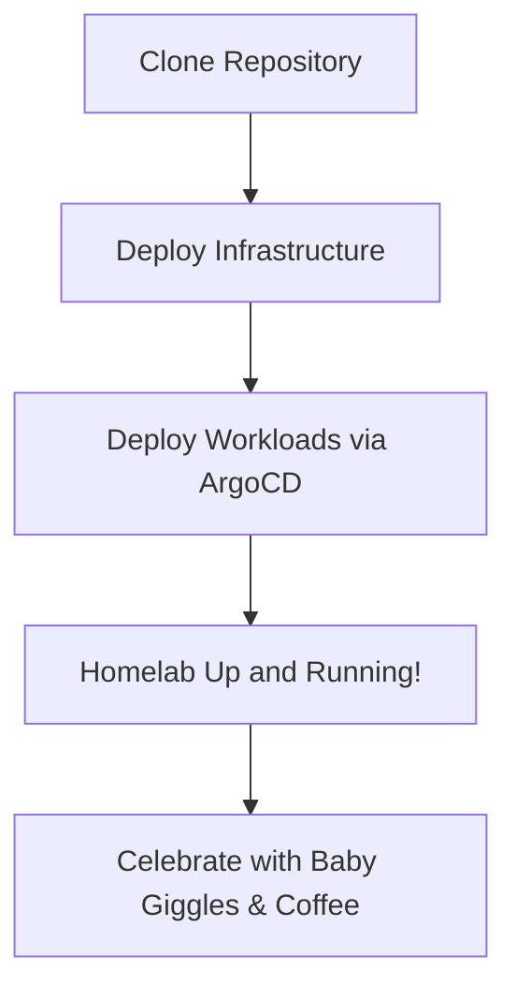

# 🏠 The Homelab That Refuses to Die

#### _Because fixing endless VMs is for the birds—and my first kid is arriving soon!_

---

## 📌 Project Summary & Key Features

**The Homelab That Refuses to Die** is a fully automated, GitOps-driven infrastructure built to be self-healing and
nearly maintenance-free. It’s designed to rescue you from the endless cycle of VM fixes so you can focus on your growing
family.

**Key Features:**

- **Three-Stage Environment Progression:** Development → Staging → Production
- **Pure GitOps Workflow:** All changes go through Git for full traceability and easy rollback.
- **Self-Healing Infrastructure:** Leveraging ArgoCD to automatically reconcile your state.
- **Zero Trust Security:** Enforced at every layer so you never worry about unauthorized changes.
- **Rapid Recovery:** Disaster recovery in just a few commands.

<div align="center" style="display: flex; justify-content: center; gap: 20px; align-items: center;">
  <a href="https://kubernetes.io">
    
  </a>
  <a href="https://talos.dev">
    
  </a>
  <a href="https://opentofu.org">
    
  </a>
  <a href="https://www.proxmox.com">
    
  </a>
</div>

<p align="center">
  <em>Built with love, caffeine, and a whole lot of "not again!" moments.</em>
</p>

<p align="center">
  
  
  
  
  
  
</p>

<details>
  <summary>📊 GitHub Stats</summary>


</details>

---

## 📌 Why This Homelab?

I was fed up with manually fixing and maintaining multiple VMs and their operating systems. With a baby on the way, I
needed a foolproof, low-maintenance system. This homelab is my answer:

- **Automation Overhead?** Gone.
- **Manual Fixes at 3 AM?** Not happening.
- **Downtime?** Reduced to a minimum.

It's designed to be robust and self-recovering—so I can focus on my family rather than fighting infrastructure
meltdowns.

---

## 🖥 Infrastructure & Applications Overview

### Core Infrastructure

Our infrastructure is built on a GitOps foundation that makes everything reproducible and auditable.

**Key Components:**

- **Talos Linux:** A Kubernetes-native OS that minimizes attack surface and maintenance.
- **ArgoCD:** Our GitOps engine that ensures the cluster state always matches Git.
- **Cilium:** Provides fast, secure networking with eBPF and native Gateway API support.
- **Longhorn & Proxmox CSI:** Distributed storage solutions for resilience and scalability.
- **Authelia & LDAP:** For centralized authentication and secure access control.

_\*\*For more details, check out our [Architecture Deep Dive](docs/architecture.md)._

### Environment Strategy

We run one Kubernetes cluster and use robust namespace isolation to separate:

- **Development:** Fast, minimal resources for rapid iteration.
- **Staging:** A production-like environment for realistic testing.
- **Production:** Fully high-availability with strict security controls.

This approach optimizes resource use without sacrificing isolation or reliability.

### Technology Stack

- **Talos Linux**
- **ArgoCD**
- **Cilium**
- **Kustomize**
- **Bitwarden** (Secrets Management)

<div align="center">
  <em>Because modern tech should work as hard as you do.</em>
</div>

---

## 🚀 Quick Start Guide

If you’re ready to deploy your foolproof homelab, follow these steps:

1. **Clone the Repository:**

   ```bash
   git clone https://github.com/theepicsaxguy/homelab.git
   cd homelab
   ```

2. **Install Dependencies:** Make sure you have [Tofu](https://opentofu.org) installed along with any other
   prerequisites.

3. **Deploy the Infrastructure:**

   ```bash
   cd tofu/kubernetes
   tofu init && tofu apply
   ```

4. **Deploy Kubernetes Workloads via ArgoCD:**

   ```bash
   cd ../../k8s
   tofu init && tofu apply
   ```

5. **Verify & Enjoy:** Check your deployment status and celebrate as your homelab comes to life—ready to self-heal and
   keep you out of midnight fix sessions.

_For more detailed deployment instructions, see our
[Disaster Recovery: The 4-Command Rule](#disaster-recovery-the-4-command-rule) section._

---

## 🛠 Operational Excellence

### Disaster Recovery: The 4-Command Rule

When disaster strikes (like an unexpected VM meltdown—or a diaper blowout), your homelab is designed to resurrect in
minutes:

```bash
# 1. Clone the repository
git clone https://github.com/theepicsaxguy/homelab.git
cd tofu/kubernetes

# 2. Deploy the infrastructure
tofu init && tofu apply

# 3. Deploy workloads via ArgoCD
cd ../../k8s
tofu init && tofu apply
```

> **Note:** Back online faster than you can say, “I need more sleep!” 😅

A quick flowchart:



---

## 📝 Documentation & Further Reading

For the geekier details and in-depth configurations, dive into:

- [Architecture Deep Dive](docs/architecture.md)
- [Network Magic Explained](docs/network-architecture.md)
- [Storage Setup](docs/storage-architecture.md)
- [Security Model](docs/security-architecture.md)
- [Monitoring Stack Overview](docs/monitoring-architecture.md)

_These docs contain all the YAML and configuration specifics so you can keep the main README lean and focused._

---

## 🌟 Project Journey & Future Vision

### Evolution

- **From VM Frustration:** Tired of endless manual fixes.
- **Kubernetes Epiphany:** Embraced a GitOps-driven approach for self-healing.
- **Talos Transition:** A move toward immutable, secure infrastructure.
- **GitOps All the Way:** If it’s not in Git, it doesn’t exist.

### Roadmap

**High Priority:**

- **Hybrid Cloud Backups:** Offload backups for extra redundancy.
- **Node Autoscaling:** Let the cluster scale dynamically.
- **Automated Disaster Recovery:** More tests, less manual intervention.

**Security & Stability:**

- **Enhanced Security Layers:** Tighter RBAC and network policies.
- **Stricter Monitoring:** Upgrading our observability stack for proactive alerts.

**Performance & Optimization:**

- **Storage Tuning:** Optimized I/O and SSD caching.
- **CI/CD Enhancements:** More automation to reduce manual work.
- **Advanced Observability:** More dashboards and metrics to keep you in the know.

---

## 🤝 Getting Involved

### Getting Started

Ready to join the revolution? Here’s your starter pack:

1. **Fork & Clone:**

   ```bash
   git clone https://github.com/theepicsaxguy/homelab.git
   cd homelab
   ```

2. **Install Dependencies:** Ensure you have [Tofu](https://opentofu.org) and other prerequisites installed.

3. **Deploy:** Follow the Quick Start Guide above to see the homelab in action.

4. **Contribute:** Fork, branch, and open a pull request with your ideas or fixes.

### Contributing Guidelines

- **Follow GitOps:** All changes must be tracked in Git.
- **Keep It Lean:** Help us keep the main docs uncluttered—details go in the dedicated docs.
- **Be Respectful:** Follow our [Code of Conduct](CONTRIBUTING.md).

---

## 💬 Community & Support

Join our community to chat, ask questions, or share your homelab adventures:

- **GitHub Issues & Discussions:** [Join Here](https://github.com/theepicsaxguy/homelab/issues)
- **Documentation:** Detailed docs are available in the [docs folder](docs/).

If you find broken links or have suggestions, please open an issue.

---

## 🤔 Final Thoughts

This isn’t just a homelab—it’s my escape from endless VM fixes and the chaos of life, engineered to be self-healing so I
can enjoy family time. It’s built for:

- **Automation:** So you (and I) can sleep in on weekends.
- **Rapid Recovery:** Because a few commands should bring everything back online.
- **Zero Headaches:** Let the system work its magic while you focus on what matters.

When things break, they get fixed. When chaos ensues, a quick command restores order. And that, my friends, is how you
free up time for family, love, and a bit of coding adrenaline.

---

## 📄 License

MIT License – See [LICENSE](LICENSE) for details.

---

## 🙏 Credits

Special thanks to the inspiration and work behind [Vehagn's Homelab](https://github.com/theepicsaxguy/homelab).
