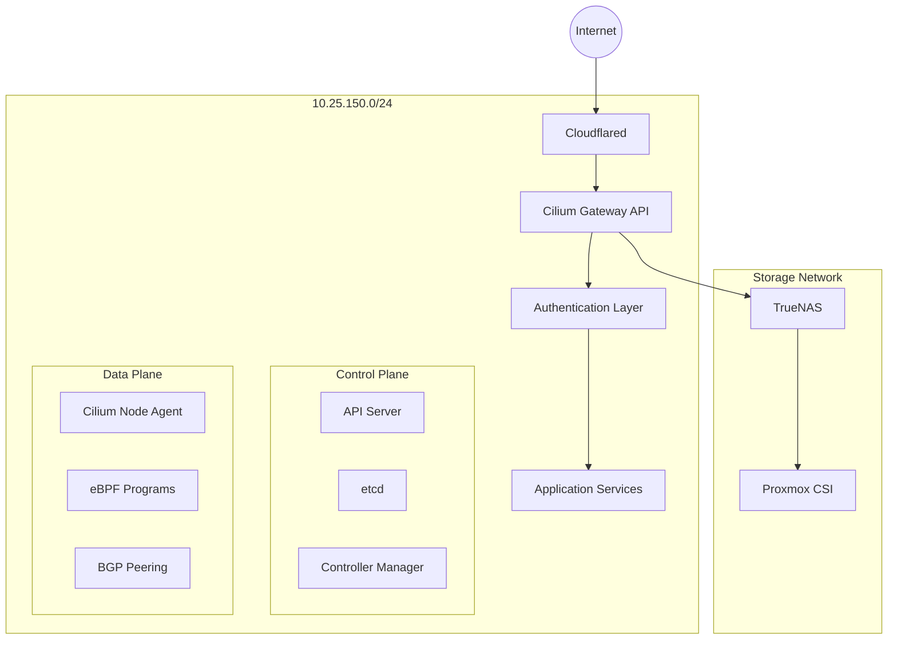

# Network Architecture

## Network Topology

## Network Components

### External Access

- Cloudflared for secure tunnel access
- Gateway API for ingress control
- BGP for network route advertisement

### Internal Networking

- Cilium CNI with eBPF
- Service mesh with mTLS
- DNS management via AdGuardHome

### Security Layers

1. Cloudflared tunnel (Edge)
2. Gateway API (Ingress)
3. Network policies (Cluster)
4. Service mesh (Service-to-service)

## Traffic Flow

### Ingress Traffic

1. External request → Cloudflared
2. Cloudflared → Gateway API
3. Gateway API → Service mesh
4. Service mesh → Pod

### Internal Traffic

1. Pod → Cilium node agent
2. eBPF program processing
3. Direct pod-to-pod routing
4. Service mesh policy enforcement

### Storage Traffic

1. Pod → CSI driver
2. CSI → TrueNAS
3. Dedicated storage network path

## Network Security

### Policy Enforcement

- Cilium network policies
- Service mesh authorization
- Ingress/Egress rules
- L7 protocol filtering

### Monitoring Points

1. Hubble for network flow visibility
2. Prometheus for metrics
3. Cilium network policy logs
4. Gateway API access logs
