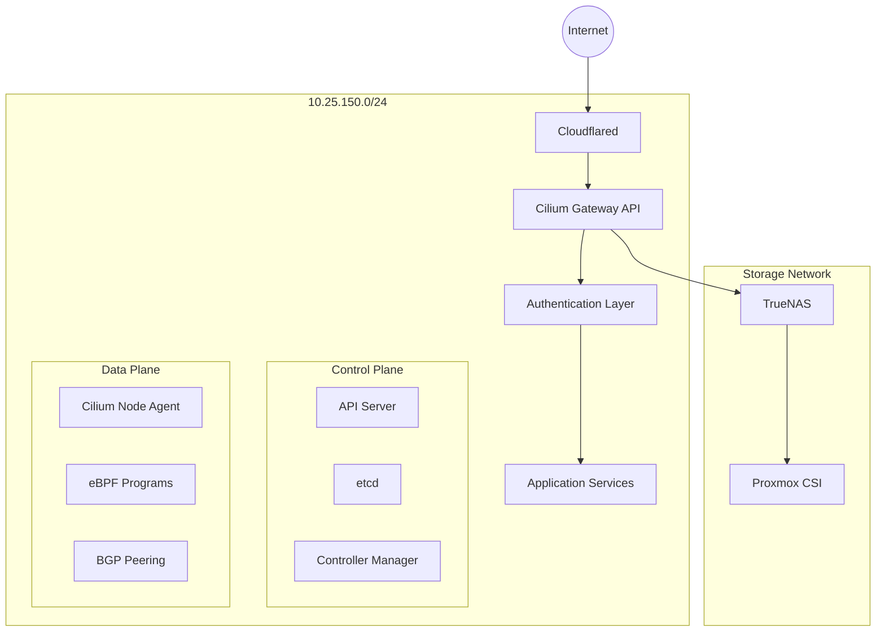

# Network Architecture

## Overview

The cluster network architecture is built on Cilium, providing advanced networking capabilities through eBPF. This
document outlines the network design, security policies, and performance considerations.

## Core Components

### Cilium Network Layer

```yaml
component:
  name: Cilium
  purpose: Primary CNI and network security
  features:
    - eBPF-based networking
    - Layer 7 proxy
    - Network policies
    - Service mesh
    - Load balancing
  performance:
    latency: Sub-millisecond
    throughput: Wire speed
    cpu_overhead: Minimal due to eBPF
```

### DNS Architecture

```yaml
component:
  name: CoreDNS
  purpose: Service discovery and DNS resolution
  configuration:
    - Internal service DNS
    - External DNS integration
    - Custom DNS policies
```

### Gateway API

```yaml
component:
  name: Cilium Gateway API
  purpose: Ingress and egress management
  features:
    - L7 load balancing
    - TLS termination
    - Traffic splitting
    - Rate limiting
```

## Services Exposure

### Services Exposed via Subdomains

- AdGuard: `adguard.pc-tips.se`
- Authelia: `authelia.pc-tips.se`
- Grafana: `grafana.pc-tips.se`
- Hubble: `hubble.pc-tips.se`
- Jellyfin: `jellyfin.pc-tips.se`
- Lidarr: `lidarr.pc-tips.se`
- Prowlarr: `prowlarr.pc-tips.se`
- Prometheus: `prometheus.pc-tips.se`
- Radarr: `radarr.pc-tips.se`
- Sonarr: `sonarr.pc-tips.se`
- Home Assistant: `haos.pc-tips.se`
- Proxmox: `proxmox.pc-tips.se`
- TrueNAS: `truenas.pc-tips.se`
- ArgoCD: `argocd.pc-tips.se`

### Services Exposed via IPs

- Unbound DNS: `10.25.150.252`
- AdGuard DNS: `10.25.150.253`
- Torrent: `10.25.150.225`
- Whoami: `10.25.150.223`

## Network Topology



## Network Components

### External Access

- Cloudflared for secure tunnel access
- Gateway API for ingress control
- BGP for network route advertisement

### Internal Networking

- Cilium CNI with eBPF
- Service mesh with mTLS
- DNS management via AdGuardHome

### Security Layers

1. Cloudflared tunnel (Edge)
2. Gateway API (Ingress)
3. Network policies (Cluster)
4. Service mesh (Service-to-service)

## Network Policies

### Default Policies

1. Zero-trust network model
2. Explicit allow rules required
3. Namespace isolation by default

### Security Zones

```yaml
zones:
  internal:
    description: 'Cluster-internal services'
    policy: 'Allow intra-zone'
  external:
    description: 'Internet-facing services'
    policy: 'Restricted access'
  control:
    description: 'Management components'
    policy: 'Highly restricted'
```

## Traffic Flow

### Ingress Traffic

1. External request → Cloudflared
2. Cloudflared → Gateway API
3. Gateway API → Service mesh
4. Service mesh → Pod

### Internal Traffic

1. Pod → Cilium node agent
2. eBPF program processing
3. Direct pod-to-pod routing
4. Service mesh policy enforcement

### Internal Traffic

1. Pod-to-Pod Communication

   - Direct routing where possible
   - No SNAT for cluster traffic
   - Policy enforcement at source

2. Service Communication
   - eBPF-based service load balancing
   - Session affinity support
   - Topology-aware routing

### External Traffic

1. Ingress

   - Gateway API controllers
   - TLS termination
   - Rate limiting
   - DDoS protection

2. Egress
   - SNAT for external traffic
   - Egress gateway support
   - Bandwidth controls

### Storage Traffic

1. Pod → CSI driver
2. CSI → TrueNAS
3. Dedicated storage network path

## Performance Optimizations

### eBPF Optimizations

- Bypass kube-proxy
- Direct routing
- Socket-level load balancing
- XDP program support

### Metrics

```yaml
baseline_metrics:
  latency:
    pod_to_pod: '<1ms'
    external: '<10ms'
  throughput:
    internal: 'Up to 10Gbps'
    external: 'Based on uplink'
```

## Network Security

### Policy Enforcement

- Cilium network policies
- Service mesh authorization
- Ingress/Egress rules
- L7 protocol filtering

### Monitoring Points

1. Hubble for network flow visibility
2. Prometheus for metrics
3. Cilium network policy logs
4. Gateway API access logs

## Monitoring

### Hubble Integration

- Network flow monitoring
- Performance metrics
- Security visibility
- Service dependency mapping

### Alert Thresholds

```yaml
alerts:
  latency:
    warning: '>5ms'
    critical: '>20ms'
  packet_loss:
    warning: '>0.1%'
    critical: '>1%'
```

## High Availability

### Network Redundancy

- Multiple gateway nodes
- Automatic failover
- Load distribution

### Failure Scenarios

1. Node Failure

   - Automatic endpoint recovery
   - Service redistribution
   - Connection draining

2. Network Partition
   - Split-brain prevention
   - Automatic reconciliation
   - Graceful degradation

## Security Measures

### Network Security

1. Encryption

   - Wireguard encryption (optional)
   - TLS for control plane
   - mTLS for services

2. Access Control
   - Network policies
   - RBAC integration
   - Identity-aware proxy

## Troubleshooting

### Common Issues

1. Connectivity Problems

   - Network policy conflicts
   - DNS resolution issues
   - MTU misconfigurations

2. Performance Issues
   - Resource contention
   - Network bottlenecks
   - Policy overhead

### Debug Tools

```yaml
tools:
  hubble: 'Network flow visibility'
  cilium: 'CLI debugging tools'
  tcpdump: 'Packet capture'
  netshoot: 'Network diagnostics'
```

## Resource Requirements

### Network Resources

```yaml
requirements:
  bandwidth:
    minimum: '1Gbps'
    recommended: '10Gbps'
  mtu:
    minimum: 1500
    recommended: 9000
  ports:
    required: [443, 6443, 4240, 51871]
```

## Future Improvements

1. Service Mesh Enhancement

   - Full mTLS adoption
   - Advanced traffic management
   - Enhanced observability

2. Performance Optimization

   - XDP program expansion
   - Enhanced load balancing
   - Reduced latency paths

3. Security Hardening
   - Zero-trust implementation
   - Enhanced encryption
   - Advanced threat detection
