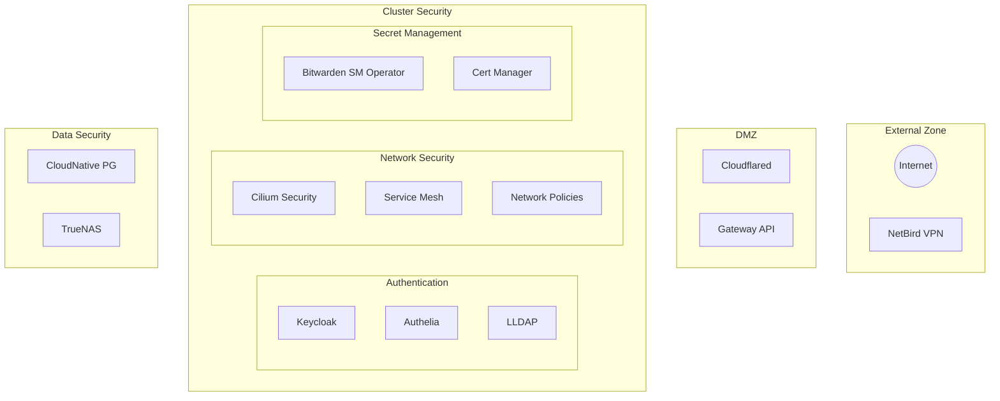

# Security Architecture

## Overview

The security architecture implements defense-in-depth through multiple layers of controls, from infrastructure to
application level security.

## Trust Boundaries



## Infrastructure Security

### Talos OS Security

```yaml
component:
  name: Talos OS
  security_features:
    - Immutable filesystem
    - No shell access
    - API-driven configuration
    - Secure boot support
    - Automatic updates
```

### Network Security

```yaml
security_layers:
  edge:
    - Cloudflare protection
    - DDoS mitigation
    - WAF rules
  internal:
    - Cilium network policies
    - mTLS enforcement
    - Microsegmentation
```

## Authentication & Authorization

### Identity Provider

```yaml
auth_stack:
  primary: Authelia
  features:
    - Multi-factor authentication
    - SSO integration
    - RBAC management
    - Access audit logs
```

### RBAC Structure

1. Cluster Access

   - Role-based permissions
   - Namespace isolation
   - Service accounts
   - Pod security policies

2. Application Access
   - OAuth2 proxy integration
   - Identity-aware proxy
   - Token-based authentication

## Secret Management

### Secret Storage

```yaml
secret_management:
  type: 'Bitwarden SM Operator'
  features:
    - Centralized secret management
    - Dynamic secret distribution
    - Automated rotation
    - Backup support
```

### Key Management

1. Certificate Management

   - cert-manager integration
   - Automatic renewal
   - ACME support

2. Encryption Keys
   - Secure key storage
   - Regular rotation
   - Access auditing

## Network Security Controls

### Ingress Security

```yaml
ingress_controls:
  gateway:
    - TLS termination
    - Rate limiting
    - IP filtering
  policies:
    - Default deny
    - Explicit allow rules
    - Traffic monitoring
```

### Pod Security

1. Pod Security Standards

   - Restricted profile
   - No privileged containers
   - Read-only root filesystem

2. Network Policies
   - Namespace isolation
   - Ingress/egress rules
   - Protocol restrictions

## Security Controls

### Identity and Access Management

- Keycloak realms for user management
- Authelia 2FA enforcement
- LLDAP for directory services
- OIDC integration for applications

### Network Security

- Cilium network policies
- mTLS between services
- eBPF-based security controls
- L7 protocol filtering

### Secret Management

- sm-operator for Git storage
- Cert-manager for TLS automation
- Kubernetes secrets encryption
- GitOps security practices

### Data Protection

- Database encryption at rest
- Storage volume encryption
- Backup encryption
- Secure data deletion

## Security Monitoring

### Detection Points

1. Network flow logs (Hubble)
2. Authentication logs
3. API server audit logs
4. Application security logs

### Incident Response

1. Alert generation
2. Automated response rules
3. Incident playbooks
4. Recovery procedures

## Monitoring and Detection

### Security Monitoring

```yaml
monitoring_stack:
  components:
    - Prometheus alerts
    - Hubble network monitoring
    - Audit logging
    - Anomaly detection
```

### Alert Thresholds

```yaml
security_alerts:
  authentication:
    failed_attempts: '>5 in 5m'
    bruteforce: '>20 in 1h'
  authorization:
    policy_violations: 'Any'
    privilege_escalation: 'Any'
```

## Incident Response

### Response Procedures

1. Detection

   - Automated alerts
   - Log correlation
   - Security scanning

2. Containment
   - Network isolation
   - Pod termination
   - Access revocation

### Recovery Process

```yaml
recovery_steps:
  immediate:
    - Isolate affected components
    - Revoke compromised credentials
    - Enable emergency access
  long_term:
    - Root cause analysis
    - Security posture improvement
    - Documentation updates
```

## Compliance Measures

### Data Privacy

- Data classification
- Access control matrices
- Audit logging
- Data retention policies

### System Hardening

- Talos secure defaults
- CIS benchmarks
- Regular security scans
- Patch management

## Compliance Controls

### Security Standards

1. CIS Benchmarks

   - Kubernetes hardening
   - Node security
   - Network controls

2. Security Best Practices
   - Least privilege
   - Defense in depth
   - Zero trust model

## Zero Trust Implementation

### Authentication

- Every request authenticated
- No trust by default
- Regular credential rotation
- Multi-factor where possible

### Authorization

- Fine-grained RBAC
- Policy-based access
- Just-in-time access
- Least privilege principle

### Continuous Verification

- Real-time policy enforcement
- Dynamic threat detection
- Behavioral monitoring
- Security metrics tracking

## Backup Security

### Backup Protection

```yaml
backup_security:
  encryption:
    type: 'AES-256'
    key_rotation: '90 days'
  access:
    authentication: 'Required'
    audit_logging: 'Enabled'
```

### Recovery Security

- Secure recovery procedures
- Access control during recovery
- Integrity verification

## Future Security Enhancements

1. Advanced Security Features

   - Runtime security monitoring
   - Advanced threat detection
   - Automated response actions

2. Authentication Improvements

   - Hardware security keys
   - Biometric authentication
   - Enhanced SSO integration

3. Compliance Enhancements
   - Additional security standards
   - Automated compliance checks
   - Enhanced reporting

## Security Guidelines

### Development Security

```yaml
secure_development:
  practices:
    - Container scanning
    - Dependency checking
    - SAST/DAST integration
  requirements:
    - No secrets in code
    - Minimal base images
    - Regular updates
```

### Operational Security

1. Access Management

   - Regular access reviews
   - Just-in-time access
   - Privilege expiration

2. Change Management
   - Security review process
   - Change documentation
   - Impact assessment

## Pod Security Standards

### Application-Specific Patterns

1. **DNS Services (e.g., AdGuard)**
   - Run as non-root
   - Read-only root filesystem
   - No privilege escalation
   - Drop all capabilities by default
   - Use seccomp profile: RuntimeDefault
   - Separate static config from secrets

2. **Secret Management Integration**
   - Environment variables over volume mounts
   - No init containers for secret injection
   - Leverage sm-operator templating
   - Use centralized infrastructure-secrets

### Security Context Example
```yaml
spec:
  template:
    spec:
      securityContext:
        seccompProfile:
          type: RuntimeDefault
      containers:
        - name: app
          securityContext:
            allowPrivilegeEscalation: false
            readOnlyRootFilesystem: true
            capabilities:
              drop: ['ALL']
```

### Configuration Management
1. **Static Configuration**
   - Store in ConfigMaps
   - Version controlled in Git
   - Applied through ArgoCD

2. **Dynamic/Sensitive Configuration**
   - Managed by sm-operator
   - Templates in Git
   - No secrets in manifests
   - Environment variable injection

3. **Application Updates**
   - All changes through GitOps
   - No direct pod or secret modification
   - Proper RBAC enforcement
   - Audit logging enabled
