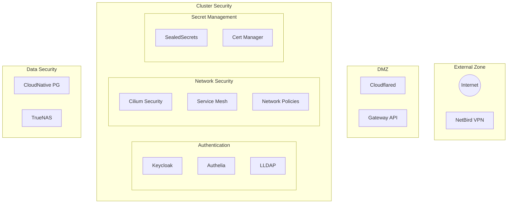

# Security Architecture

## Trust Boundaries

## Security Controls

### Identity and Access Management

- Keycloak realms for user management
- Authelia 2FA enforcement
- LLDAP for directory services
- OIDC integration for applications

### Network Security

- Cilium network policies
- mTLS between services
- eBPF-based security controls
- L7 protocol filtering

### Secret Management

- SealedSecrets for Git storage
- Cert-manager for TLS automation
- Kubernetes secrets encryption
- GitOps security practices

### Data Protection

- Database encryption at rest
- Storage volume encryption
- Backup encryption
- Secure data deletion

## Security Monitoring

### Detection Points

1. Network flow logs (Hubble)
2. Authentication logs
3. API server audit logs
4. Application security logs

### Incident Response

1. Alert generation
2. Automated response rules
3. Incident playbooks
4. Recovery procedures

## Compliance Measures

### Data Privacy

- Data classification
- Access control matrices
- Audit logging
- Data retention policies

### System Hardening

- Talos secure defaults
- CIS benchmarks
- Regular security scans
- Patch management

## Zero Trust Implementation

### Authentication

- Every request authenticated
- No trust by default
- Regular credential rotation
- Multi-factor where possible

### Authorization

- Fine-grained RBAC
- Policy-based access
- Just-in-time access
- Least privilege principle

### Continuous Verification

- Real-time policy enforcement
- Dynamic threat detection
- Behavioral monitoring
- Security metrics tracking
