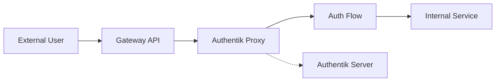

# Authentik SSO Integration Guide

This guide covers the setup and management of Authentik Single Sign-On (SSO) in our Kubernetes cluster.

## Architecture Overview

Authentik is deployed with two main components:

1. **Authentik Server**
   - Core authentication service
   - User management interface
   - Policy configuration
   - Accessible at https://sso.pc-tips.se

2. **Proxy Outpost**
   - Authentication proxy (ports 9000/9443)
   - Handles SSO for protected applications
   - Integrated with Cilium Gateway API

## Proxy Architecture



## Database Reliability

The Authentik database now runs two PostgreSQL instances via the Zalando operator. The manifest sets `numberOfInstances: 2` in `database.yaml`. This offers pod-level failover using Longhorn storage. It's not a multi-region cluster, but it prevents outages from a single pod failure.

## Configuration Guide

### 1. Protecting a New Application

#### Step 1: Authentik Configuration

1. Access Authentik admin interface (https://sso.pc-tips.se)
2. Create a new Proxy Provider:
   ```yaml
   name: my-application
   external_host: app.pc-tips.se
   internal_host: http://my-service.namespace.svc:8080
   mode: forward_single
   ```
3. Create an Application:
   ```yaml
   name: My Application
   slug: my-application
   provider: my-application-proxy
   policy_engine_mode: any
   ```

#### Step 2: Gateway Configuration

Create an HTTPRoute:

```yaml
apiVersion: gateway.networking.k8s.io/v1
kind: HTTPRoute
metadata:
  name: my-application
  namespace: my-namespace
spec:
  parentRefs:
    - name: external  # or internal based on access needs
      namespace: gateway
  hostnames:
    - "app.pc-tips.se"
  rules:
    - matches:
        - path:
            type: PathPrefix
            value: /
      backendRefs:
        - name: authentik-proxy
          namespace: auth
          port: 9000
```

### 2. Security Best Practices

#### Network Policies

```yaml
apiVersion: cilium.io/v2
kind: CiliumNetworkPolicy
metadata:
  name: allow-authentik-proxy
  namespace: my-namespace
spec:
  endpointSelector:
    matchLabels:
      app: my-service
  ingress:
    - fromEndpoints:
        - matchLabels:
            app: authentik-proxy
            io.kubernetes.pod.namespace: auth
```

#### TLS Configuration

- Always use HTTPS for external access
- Certificates managed by cert-manager
- Internal communication can use HTTP

## Maintenance Guide

### 1. Regular Tasks

- Monitor Authentik logs for security events
- Review access policies quarterly
- Update Authentik version when available
- Rotate API tokens annually

### 2. Troubleshooting

#### Authentication Issues

1. Check Proxy Status:
```bash
kubectl -n auth logs -l app=authentik-proxy
```

2. Verify Network Policies:
```bash
kubectl -n auth get ciliumnetworkpolicies
```

3. Test Authentication Flow:
```bash
curl -v https://app.pc-tips.se
# Should redirect to SSO
```

#### Common Issues

1. **503 Service Unavailable**
   - Check Proxy deployment status
   - Verify backend service health
   - Review network policies

2. **Authentication Loop**
   - Clear browser cookies
   - Check Provider configuration
   - Verify cookie domains

3. **Backend Unreachable**
   - Verify service DNS resolution
   - Check network policy rules
   - Validate service ports

## Integration Examples

### Basic Web Application

```yaml
# HTTPRoute for a basic web app
apiVersion: gateway.networking.k8s.io/v1
kind: HTTPRoute
metadata:
  name: webapp
  namespace: apps
spec:
  parentRefs:
    - name: external
      namespace: gateway
  hostnames:
    - "webapp.pc-tips.se"
  rules:
    - matches:
        - path:
            type: PathPrefix
            value: /
      backendRefs:
        - name: authentik-proxy
          namespace: auth
          port: 9000
```

### API Service

```yaml
# HTTPRoute for an API service
apiVersion: gateway.networking.k8s.io/v1
kind: HTTPRoute
metadata:
  name: api
  namespace: services
spec:
  parentRefs:
    - name: internal
      namespace: gateway
  hostnames:
    - "api.internal.pc-tips.se"
  rules:
    - matches:
        - path:
            type: PathPrefix
            value: /
      backendRefs:
        - name: authentik-proxy
          namespace: auth
          port: 9000
```

## Performance Optimization

1. **Caching Configuration**
   - Enable Redis caching
   - Configure appropriate TTLs
   - Monitor cache hit rates

2. **Resource Allocation**
   ```yaml
   resources:
     requests:
       cpu: 500m
       memory: 512Mi
     limits:
       cpu: 1000m
       memory: 1Gi
   ```

## Monitoring

### Key Metrics

- Authentication success/failure rates
- Response times
- Session counts
- Token validity

### Alert Rules

```yaml
alerts:
  - auth_failure_rate > 10%
  - response_time_95th > 2s
  - proxy_5xx_rate > 1%
```
